# Pearls AQI Predictor

## End-to-End Serverless Air Quality Forecasting and MLOps System

**Project:** Pearls AQI Predictor  
**Goal:** Predict AQI for the next 3 days  
**Target region:** Major cities in Pakistan  
**Feature Store:** Hopsworks  
**Model Registry:** Hopsworks  
**Dashboard:** Streamlit Community Cloud  
**Production model:** `pearls_aqi_daily_ensemble`  
**Hopsworks model version:** `2`  
**Production training artifact:** `20260729T212359325910Z`  
**Production project version:** `6.8.0`  
**Feature Group version:** `9`  
**Repository:** https://github.com/Kashan1272/Aqi_prediction  
**Live application:** `https://aqiprediction-ai.streamlit.app/`

---

# 1. Executive Summary

Pearls AQI Predictor is an end-to-end air-quality forecasting and MLOps system designed to predict Air Quality Index (AQI) for the next three days for major cities in Pakistan.

The project was implemented as a managed/serverless architecture. Data collection, feature generation, historical backfilling, model training, model registration, scheduled forecasting, Feature Store materialization, and dashboard serving are separated into independent components. Hopsworks provides the central Feature Store, Model Registry, scheduled compute jobs, and offline materialization. Streamlit Community Cloud provides the public dashboard.

The final implementation includes:

- External weather and air-quality data integration
- Historical feature and target backfilling
- Time-based and derived feature engineering
- Hopsworks Feature Store integration
- Automated hourly feature/forecast pipeline
- Automated daily model-training pipeline
- Multiple Scikit-learn forecasting models
- A PyTorch deep-learning experiment
- Chronological train/validation/test evaluation
- RMSE, MAE, R², bias, Day-3, and macro-city evaluation
- Hopsworks Model Registry champion/challenger workflow
- SHAP explainability
- AQI health and hazardous-level alerts
- Interactive current-AQI and 3-day forecast dashboard
- Streamlit Community Cloud deployment
- Final evidence, EDA plots, explainability plots, and model-comparison artifacts

The current production ensemble achieved a pooled test **R² of 0.7473**, **RMSE of 17.3178**, **MAE of 12.2618**, and **bias of -0.0245**. Day-3 performance was lower, as expected for a longer horizon, with **R² of 0.6311** and **RMSE of 20.9695**.

A key interpretation point is that the pooled R² and the city-level macro R² answer different questions. The production model's **macro-city R² is 0.4767**, which is lower than the pooled R² because it gives each city equal weight. During development, **Multan repeatedly produced a weaker city-level R² because its usable historical AQI target coverage was more limited than for the stronger training cities**. This reduced the amount of past city-specific behaviour available to learn and pulled down the equal-weight city-level aggregate. Therefore, the lower macro-city R² should not be interpreted as a contradiction of the pooled production R²; it reflects uneven historical coverage and performance across cities.

---

# 2. Project Requirements and Completion Matrix

The original project brief requires a 3-day AQI prediction service, feature generation, historical backfill, Feature Store, model training and registry, automation, a web application, EDA, model variety including deep learning, explainability, hazardous-AQI alerts, and a detailed final report.

| Requirement | Implementation | Status |
|---|---|---|
| Predict AQI for the next 3 days | Production ensemble generates Day 1, Day 2, and Day 3 forecasts | Completed |
| Managed/serverless stack | Hopsworks managed jobs/storage + Streamlit Community Cloud | Completed |
| Fetch weather and pollutant data | External provider ingestion integrated into hourly pipeline | Completed |
| Compute model features and targets | Pollution, weather, time, lag, rolling, seasonal, provider and derived features | Completed |
| Hour/day/month and derived AQI features | Time encodings, seasonal indicators, AQI change and rolling features | Completed |
| Store features in Feature Store | Hopsworks Feature Groups v9 | Completed |
| Historical backfill | Historical feature/target data generated for model training | Completed |
| Fetch historical features/targets for training | Daily training pipeline hydrates/rebuilds training data | Completed |
| Experiment with Scikit-learn models | Ridge, Random Forest, Extra Trees, HistGradientBoosting and ensembles | Completed |
| Experiment with TensorFlow/PyTorch | PyTorch MLP experiment | Completed |
| Evaluate RMSE, MAE and R² | All core evaluations include required metrics | Completed |
| Store trained model in Model Registry | `pearls_aqi_daily_ensemble`, Hopsworks version 2 | Completed |
| Feature pipeline every hour | `aqi_hourly_v69`, at minute 17 every hour | Completed |
| Training pipeline every day | `aqi_daily_training_v69`, daily at 03:25 UTC | Completed |
| Web dashboard | Streamlit production dashboard | Completed |
| Real-time/current + forecast AQI | Latest Feature Store AQI + Day 1-3 predictions | Completed |
| EDA | City, monthly, seasonal, distribution, correlations, missingness and relationships | Completed |
| SHAP or LIME | SHAP Day-1 and Day-3 explainability | Completed |
| Hazardous AQI alerts | Dashboard alert banner with severity thresholds | Completed |
| End-to-end system | Data → Feature Store → model → predictions → dashboard | Completed |
| Scalable automated pipeline | Hopsworks managed scheduled jobs and precomputed serving | Completed |
| Detailed final report | This document | Completed |

---

# 3. Problem Definition

Air quality changes over time because pollutant emissions interact with weather, atmospheric mixing, seasonal conditions, transport, and local pollution patterns. A useful AQI forecasting system therefore needs both historical pollution behaviour and future weather information.

The system is designed to answer:

> **What will the daily mean and expected peak AQI be for a selected city over the next three days?**

The application also presents the latest available AQI and converts the predicted AQI into understandable health categories and alerts.

---

# 4. System Architecture

## 4.1 Logical Architecture

```text
External Weather / Pollution Providers
                |
                v
        Raw Data Ingestion
                |
                v
        Feature Engineering
                |
                v
       Hopsworks Feature Store
                |
        +-------+------------------+
        |                          |
        v                          v
Hourly Production Job       Daily Training Job
        |                          |
        |                    Historical Features
        |                          |
        |                    Candidate Training
        |                          |
        |                    Evaluation / Gate
        |                          |
        |                    Model Registry
        |                          |
        +------------+-------------+
                     |
                     v
             Production Ensemble
                     |
                     v
           3-Day AQI Predictions
                     |
                     v
      aqi_daily_predictions_v69
                     |
                     v
       Streamlit Community Cloud
```

## 4.2 Serving Architecture

The production web app intentionally does not retrain models or call every external provider on each page load.

Instead:

1. Scheduled Hopsworks jobs collect/update features.
2. The production forecasting job generates forecasts.
3. Forecasts are persisted in `aqi_daily_predictions_v69`.
4. The Streamlit app reads precomputed production predictions and recent AQI observations from Hopsworks.
5. The app reads production model metadata from the Hopsworks Model Registry.

This design reduces latency and isolates dashboard traffic from expensive model computation.

---

# 5. Technology Stack

| Component | Technology |
|---|---|
| Language | Python |
| Data processing | Pandas, NumPy |
| Classical ML | Scikit-learn |
| Deep learning | PyTorch |
| Explainability | SHAP |
| Feature Store | Hopsworks Feature Store |
| Model Registry | Hopsworks Model Registry |
| Offline Feature Store storage | Hopsworks / Hudi materialization |
| Visualization | Matplotlib, Plotly |
| Web dashboard | Streamlit |
| Public deployment | Streamlit Community Cloud |
| Job scheduling | Hopsworks Jobs |
| Source control | GitHub |
| Local secrets | `.env` |
| Cloud secrets | Streamlit Secrets |
| Serialization | Joblib / model artifacts |

---

# 6. External Data and Provider Strategy

The implementation uses external weather and air-quality provider data to maintain current observations and future-facing forecasting inputs. Provider-related features in the production pipeline include Open-Meteo forecast information and current air-quality/provider observations.

Examples of provider-derived training fields include:

- `provider_openaq_current_aqi`
- `provider_open_meteo_current_aqi`
- `provider_open_meteo_aqi_mean`
- `provider_open_meteo_aqi_max`
- `provider_forecast_count`
- `provider_mean_consensus`
- `provider_mean_spread`
- `provider_mean_range`
- `provider_max_consensus`
- `provider_max_spread`
- `provider_max_range`
- `provider_current_sensor_bias`

The pipeline does not assume that every provider is always available. Provider snapshots and consensus/spread features allow the model to incorporate multiple signals while keeping the core pipeline independent of any single dashboard request.

---

# 7. Historical Backfill

Historical data was generated before final model training so that the forecasting models could learn past AQI, pollutant, weather, seasonal, and lag relationships.

The EDA dataset covered:

- **175,200 hourly rows**
- **7,310 daily city observations**
- **10 cities**
- **25 July 2024 to 24 July 2026**

Historical backfill supports:

- Training targets
- Lag features
- Rolling statistics
- Seasonal comparison
- City climatology
- Chronological model evaluation
- Model retraining

---

# 8. Feature Engineering

Feature engineering is a major component of the project because AQI forecasting depends on both current conditions and recent temporal context.

## 8.1 Pollution Features

Examples include:

- PM2.5 mean and maximum
- PM10 statistics
- Ozone statistics
- NO₂-related measurements
- SO₂-related measurements
- CO-related measurements
- US AQI mean, median and maximum
- AQI peak excess

## 8.2 Weather Features

Examples include:

- Temperature
- Relative humidity
- Pressure
- Wind speed
- Wind direction
- Future temperature statistics
- Future wind statistics

## 8.3 Time-Based Features

The project includes the time-based information requested in the brief:

- Hour
- Day
- Month
- Day of year
- Cyclical sine/cosine encodings
- Seasonal regime indicators

## 8.4 AQI Change and Temporal Dynamics

Examples include:

- `aqi_mean_change_1d`
- Daily AQI change rate
- Previous-day AQI
- Rolling means
- 7-day exponentially weighted means
- 14-day rolling statistics

## 8.5 Seasonal Features

Important Pakistan-specific seasonal regimes include:

- Winter Smog
- Pre-Monsoon
- Monsoon

## 8.6 Derived Atmospheric Features

Examples include:

- Future ventilation proxy
- Future wind-vector components
- Future stagnation indicators
- Pressure anomaly features
- City-month climatology

These features help represent whether future weather is likely to disperse pollution or allow it to accumulate.

---

# 9. Hopsworks Feature Store

The production system stores data in four main Hopsworks Feature Groups:

1. `aqi_hourly_v69`
2. `aqi_daily_training_v69`
3. `aqi_provider_snapshots_v69`
4. `aqi_daily_predictions_v69`

**Feature Group version:** `9`

The Hopsworks project shows **4 Feature Groups** and **843 registered features** in the Feature Store.

The implementation uses Feature Groups directly through the Hopsworks SDK. A Hopsworks Feature View is not required for the implemented training/serving path, so the Hopsworks home page may show zero Feature Views without indicating an error.

Similarly, Hopsworks Model Deployment is not used because the public dashboard serves precomputed predictions through Streamlit Cloud rather than deploying an online inference endpoint inside Hopsworks.

## Evidence

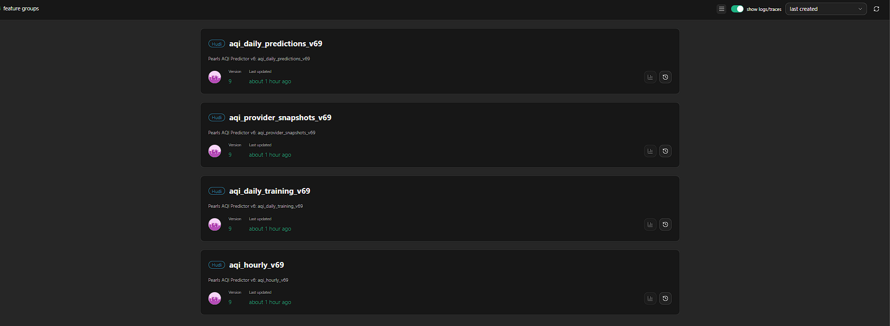

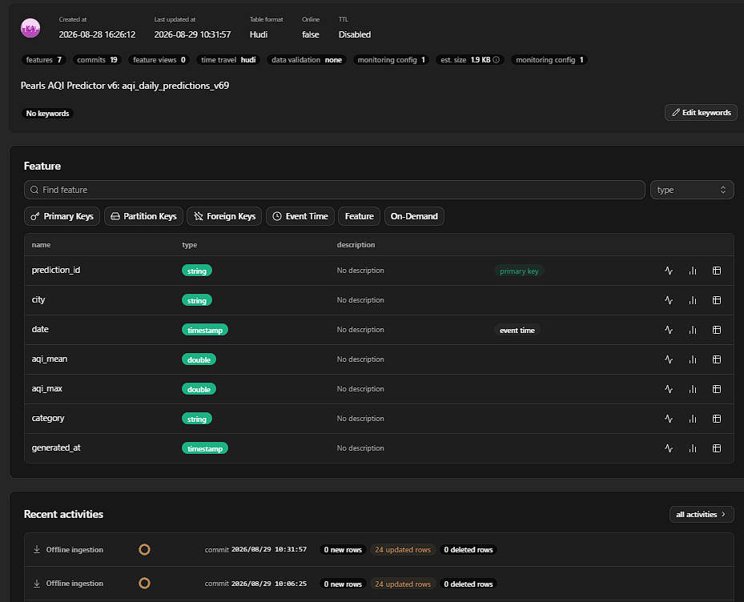

---

# 10. Exploratory Data Analysis

EDA was performed to identify trends before final project reporting.

Generated artifacts are stored under:

```text
reports/eda/
```

## 10.1 Dataset Summary

- Hourly rows analyzed: **175,200**
- Daily city observations: **7,310**
- Cities analyzed: **10**
- Data range: **2024-07-25 to 2026-07-24**
- Overall mean AQI: **119.81**
- Overall median AQI: **109.67**
- Maximum daily AQI: **486.08**
- AQI ≥ 151: **23.56% of city-days**

The high share of unhealthy-or-worse city-days confirms that the forecasting problem is operationally meaningful.

## 10.2 City-Level AQI

Faisalabad had the highest average AQI in the EDA dataset.

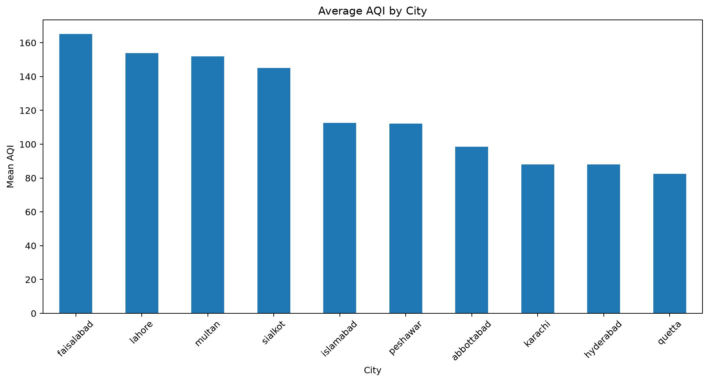

## 10.3 Monthly and Seasonal Behaviour

The month with the highest average AQI in the generated EDA summary was **January 2026**.

The highest average seasonal regime was **Winter Smog**.

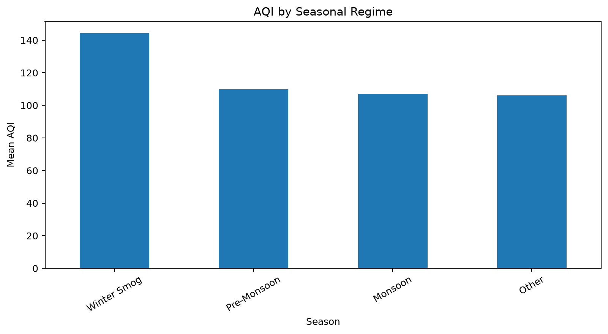

This supports the inclusion of seasonal and climatological features.

## 10.4 Pollutant and Weather Relationships

The strongest positive AQI correlation in the EDA output was:

- **PM2.5: approximately +0.770**

The strongest negative relationship reported in the EDA summary was:

- **Wind speed: approximately -0.267**

This is consistent with the model later assigning meaningful importance to PM2.5 and future wind features.

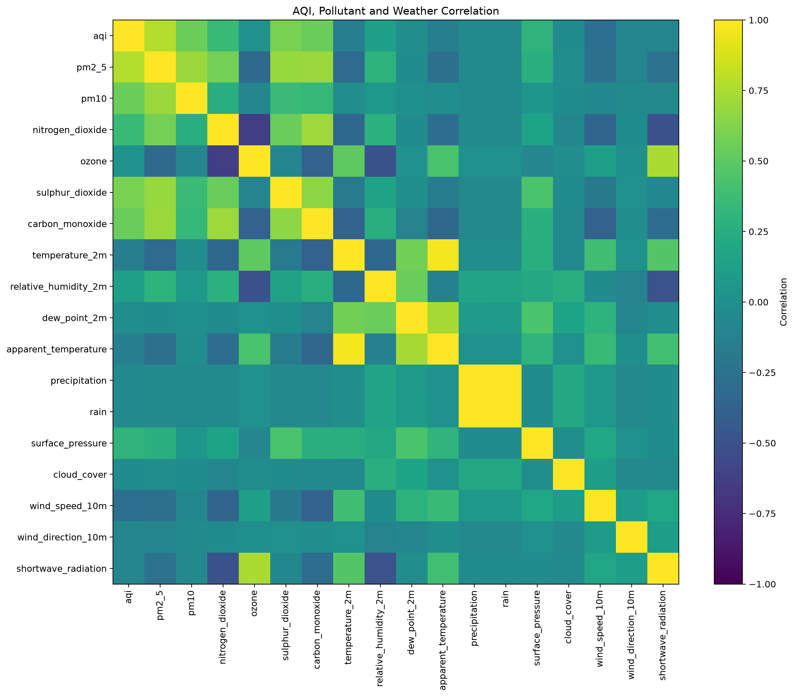

## 10.5 Missingness

The generated EDA summary reported no missing values for the highest-ranked missingness field in the analyzed EDA matrix, indicating that the final EDA dataset used for these charts was highly complete after preparation.

---

# 11. Model Development Strategy

The project evaluates multiple forecasting approaches instead of relying on one algorithm.

Classical model families explored include:

- Ridge Regression
- Random Forest
- Extra Trees
- Histogram Gradient Boosting
- Ensemble / stacked combinations

A separate PyTorch neural-network experiment was added to satisfy the requirement to explore deep learning.

The production model is an ensemble rather than the deep-learning model because model selection is based on held-out chronological performance.

---

# 12. Chronological Evaluation Design

Random train/test splitting is inappropriate for forecasting because it can allow future information to leak into past training periods.

The project therefore uses chronological partitions.

For the deep-learning experiment, the split was:

- **Training:** 70%
- **Validation:** 15%
- **Test:** 15%

Deep-learning split details:

- Train: **5,100 rows**, 2024-07-25 to 2025-12-16
- Validation: **1,100 rows**, 2025-12-17 to 2026-04-05
- Test: **1,100 rows**, 2026-04-06 to 2026-07-24

This maintains the temporal order required for a realistic forecasting evaluation.

---

# 13. Evaluation Metrics

The required metrics are:

- **RMSE** – penalizes larger errors
- **MAE** – average absolute prediction error
- **R²** – proportion of variation explained
- **Bias** – average signed prediction error

The production system also tracks:

- Day-3 R²
- Day-3 RMSE
- Day-3 bias
- Macro-city R²

---

# 14. Production Model

The production model is:

```text
pearls_aqi_daily_ensemble
```

Local production artifact:

```text
20260729T212359325910Z
```

Hopsworks Model Registry version:

```text
2
```

Framework:

```text
Scikit-learn
```

The production artifact passed the project's quality gate and is the current champion.

## 14.1 Production Test Metrics

| Metric | Production Result |
|---|---:|
| R² | **0.7473** |
| RMSE | **17.3178** |
| MAE | **12.2618** |
| Bias | **-0.0245** |
| Day-3 R² | **0.6311** |
| Day-3 RMSE | **20.9695** |
| Day-3 Bias | **0.4627** |
| Macro-city R² | **0.4767** |

The nearly zero pooled bias is a strong result because the production predictions are not systematically shifted high or low overall.

## 14.2 Why Day-3 Performance Is Lower

Day-3 forecasting has more uncertainty because:

- The forecast is farther from the latest observed AQI.
- Future weather uncertainty grows with horizon.
- Pollution events can change rapidly.
- Recent lag information becomes less directly predictive.

Therefore, Day-3 R² being lower than the pooled daily-mean R² is expected.

---

# 15. Multan Data-Coverage Effect and City-Level R²

During repeated city-level training and evaluation, **Multan consistently returned a lower R² than the stronger cities**.

The important reason identified during development was **limited usable historical AQI target coverage for Multan compared with cities that had a richer past record**. A forecasting model can only learn recurring city-specific AQI behaviour when enough historical target variation exists.

This has an important effect on how the final metrics should be interpreted:

- **Pooled R² = 0.7473** evaluates all held-out observations together.
- **Macro-city R² = 0.4767** first evaluates cities separately and then gives each city equal importance.
- A weak-R² city such as Multan therefore has a much larger effect on the macro-city metric than it has on the pooled metric.

Consequently, the lower macro-city R² is not evidence that the entire production model performs at only 0.48 R². It shows that city-level forecasting difficulty is uneven, and that limited historical coverage in cities such as Multan lowers the equal-weight cross-city score.

This is also why increasing clean historical AQI coverage for Multan is one of the highest-value future improvements.

No unsupported city-specific R² value is reported here because the key observed issue was the repeated relative weakness of Multan, not a single stable R² number across every training run.

---

# 16. Deep-Learning Experiment

A PyTorch multilayer perceptron (MLP) was trained as an advanced-model experiment.

## 16.1 Architecture

The model used:

- 32 input features
- Dense layer: 128 units
- ReLU
- Dropout
- Dense layer: 64 units
- ReLU
- Dropout
- Dense layer: 32 units
- Output layer: 1 AQI prediction
- AdamW optimizer
- Mean Squared Error loss
- Early stopping

Training stopped at epoch **33**.

## 16.2 Deep Model Results

| Model | RMSE | MAE | R² | Bias |
|---|---:|---:|---:|---:|
| PyTorch MLP | **22.6754** | **18.1614** | **0.5434** | **+13.1523** |
| Persistence baseline | **20.6412** | **13.2486** | **0.6216** | **-0.0709** |
| Production ensemble | **17.3178** | **12.2618** | **0.7473** | **-0.0245** |

The MLP underperformed both the persistence baseline and production ensemble.

This is a useful result rather than a project failure. It demonstrates that the more complex model was objectively evaluated and rejected for production because it did not improve generalization.

## Evidence

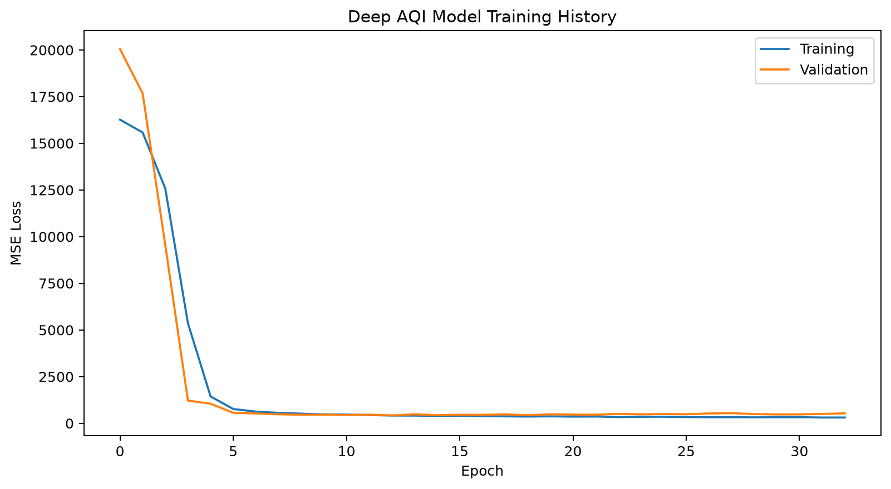

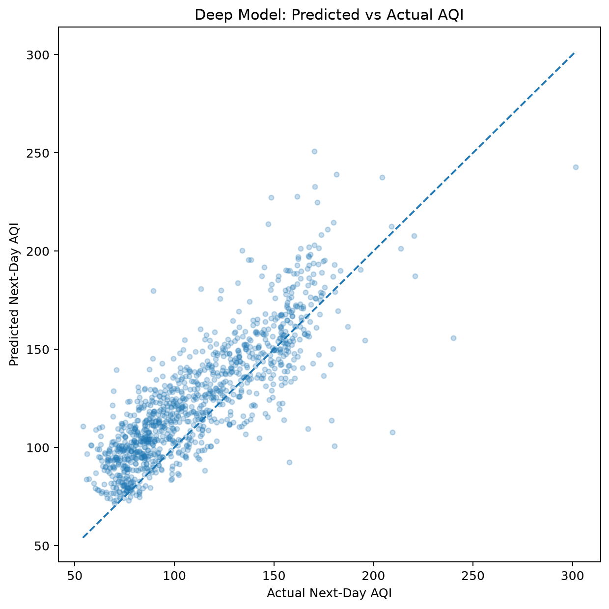

---

# 17. Explainable AI with SHAP

SHAP was used to explain the production model's dominant ensemble components.

Explainability artifacts are stored in:

```text
reports/explainability/
```

## 17.1 Day-1 AQI SHAP Importance

Top Day-1 features:

| Rank | Feature | Mean Absolute SHAP Importance |
|---:|---|---:|
| 1 | `pm2_5__mean` | 25.7823 |
| 2 | `pm2_5__max` | 3.6180 |
| 3 | `aqi_peak_excess` | 1.7773 |
| 4 | `future_wind_speed_10m__mean` | 1.0168 |
| 5 | `pm10__max` | 0.8177 |
| 6 | `us_aqi__median` | 0.7980 |
| 7 | `us_aqi__max` | 0.7333 |
| 8 | `future_ventilation_proxy` | 0.7047 |
| 9 | `aqi_mean_change_1d` | 0.6452 |
| 10 | `ozone__max` | 0.6165 |

PM2.5 is clearly dominant at the shortest forecast horizon.

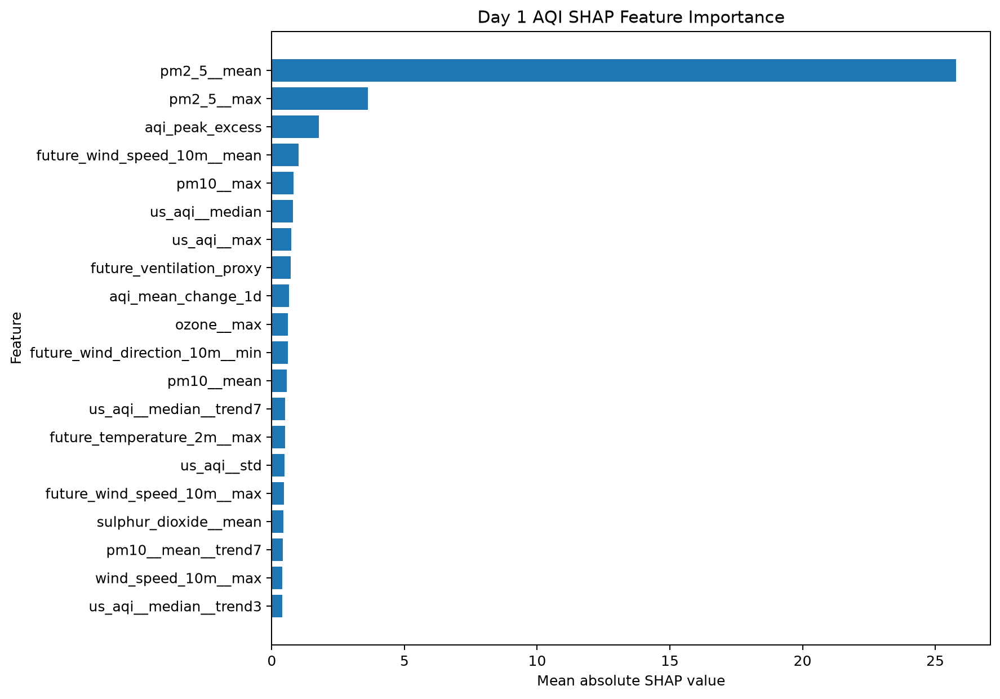

## 17.2 Day-3 AQI SHAP Importance

Top Day-3 features:

| Rank | Feature | Mean Absolute SHAP Importance |
|---:|---|---:|
| 1 | `pm2_5__mean__ewm7` | 5.4019 |
| 2 | `us_aqi__mean__ewm7` | 4.1563 |
| 3 | `pm2_5__mean` | 3.9941 |
| 4 | `future_wind_speed_10m__mean` | 2.6769 |
| 5 | `aqi_city_month_climatology` | 2.3918 |
| 6 | `future_wind_direction_10m__min` | 1.8522 |
| 7 | `target_doy_cos` | 1.7046 |
| 8 | `pm2_5__mean__roll14_mean` | 1.6723 |
| 9 | `future_wind_v` | 1.4240 |
| 10 | `future_temperature_2m__max` | 1.4195 |

The Day-3 explanation shows a shift toward smoothed history, climatology, seasonality, and future weather, which is expected as forecast horizon increases.

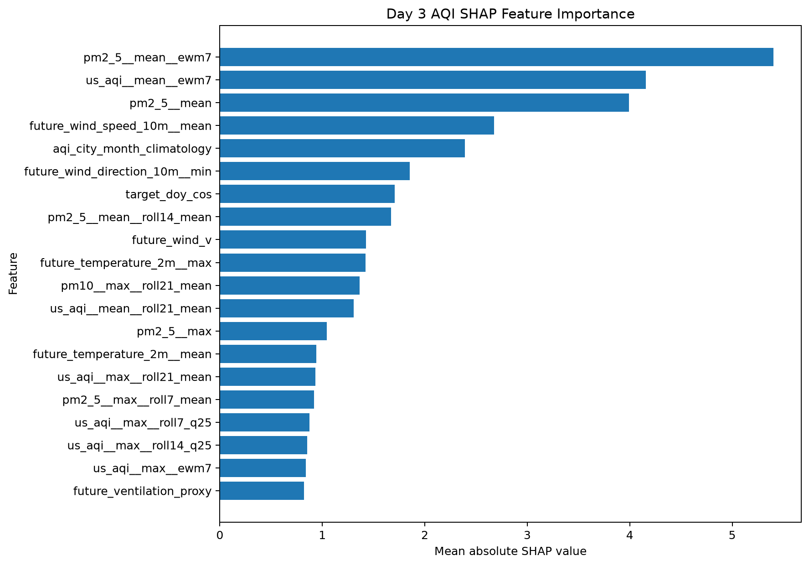

---

# 18. Model Registry and Champion Management

Hopsworks Model Registry stores the production model and challenger versions.

Current production entry:

```text
Model: pearls_aqi_daily_ensemble
Hopsworks version: 2
Framework: SKLEARN
```

The training workflow evaluates a candidate before production promotion. A newly trained candidate does not automatically replace the champion merely because training completed.

This champion/challenger approach protects the system from accidental performance regressions.

## Evidence

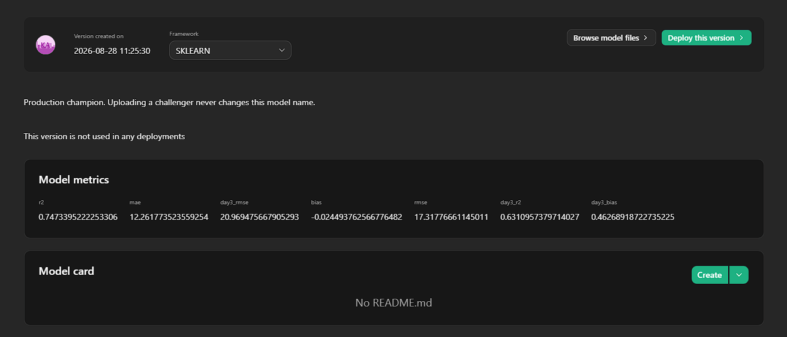

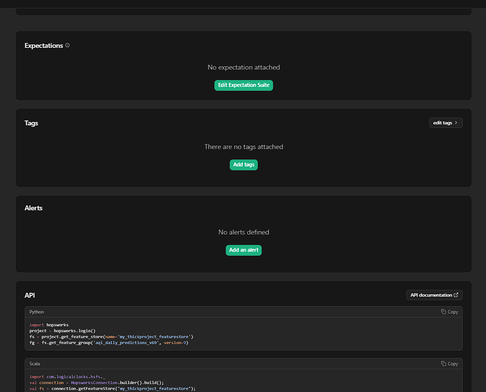

The Hopsworks UI correctly reports that this model is not used in a Hopsworks Model Deployment. The project does not require a Hopsworks online model endpoint because the production architecture serves scheduled, precomputed forecasts from the Feature Store through Streamlit Cloud.

---

# 19. Automated Hourly Production Pipeline

The hourly production job is:

```text
aqi_hourly_v69
```

Schedule:

```text
17 * * * *
```

Meaning:

> Run at minute 17 of every hour.

The job is enabled in Hopsworks.

Main workflow:

```text
hydrate_hopsworks.py --features --model
        |
        v
forecast.py --city all
        |
        v
sync_hopsworks.py --features --city all
```

This job:

- Hydrates latest Feature Store data
- Loads the production model
- Generates forecasts
- Synchronizes updated features
- Writes production predictions

Hopsworks also launches Spark Feature Group materialization jobs during offline writes. These Spark jobs are normal platform behaviour.

## Evidence

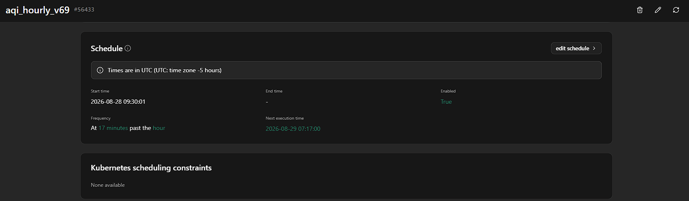

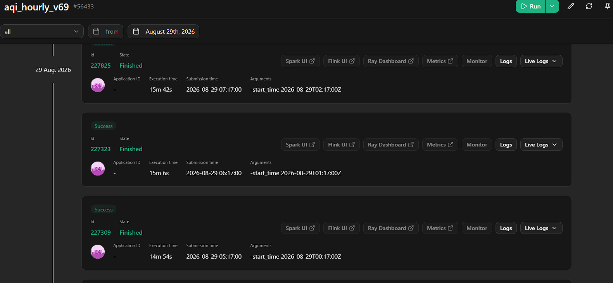

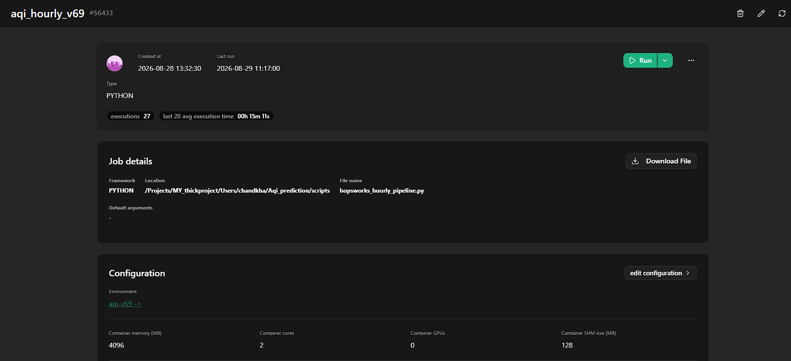

---

# 20. Hourly Job Reliability

The hourly job history includes many successful executions and occasional failed executions.

Because the hourly workflow depends on external APIs, networking, cloud storage, and Hopsworks materialization, an individual failed run can occur even when the pipeline design is correct. The exact root cause of a specific failed execution should only be assigned when its logs are available.

The important operational behaviour is:

- The schedule remains enabled.
- A failure does not disable future runs.
- Later scheduled runs have successfully recovered.
- Feature Group materialization continues to complete successfully.

A future hardening improvement is to add retry policies and exponential backoff around external provider calls and transient cloud operations.

---

# 21. Automated Daily Training Pipeline

The daily training job is:

```text
aqi_daily_training_v69
```

Schedule:

```text
25 3 * * *
```

Meaning:

> Run every day at 03:25 UTC.

The daily training workflow:

1. Hydrates Feature Store data.
2. Runs strict data validation.
3. Rebuilds the chronological training matrix.
4. Trains candidate models.
5. Evaluates the candidate.
6. Applies the promotion/quality gate.
7. Uploads the candidate to Hopsworks.
8. Updates the production champion only if promotion conditions are met.

The daily job has completed successfully in Hopsworks.

## Evidence

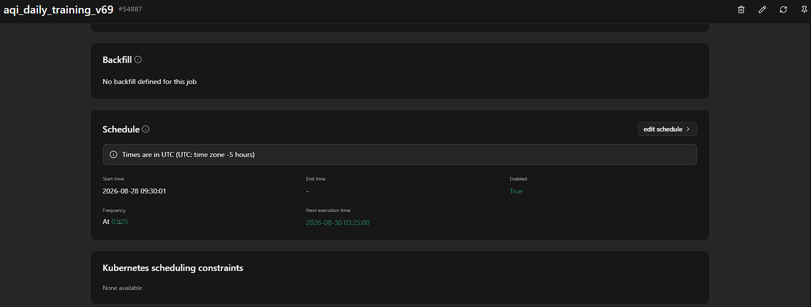

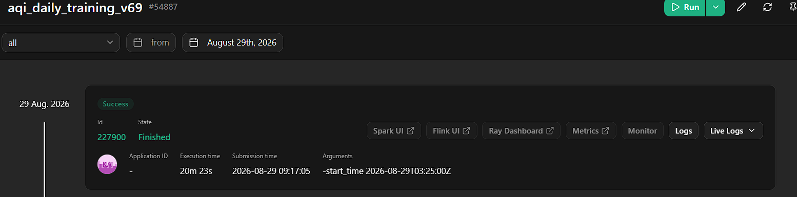

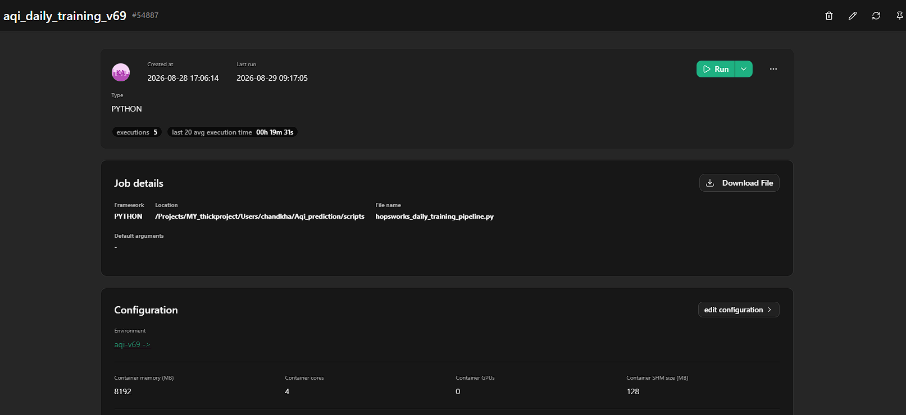

---

# 22. Automation Choice

The project brief suggests CI/CD tools such as Airflow or GitHub Actions but explicitly allows other tools.

This implementation uses the **Hopsworks Jobs scheduler** for the production cadence:

- Hourly feature/forecast pipeline
- Daily training pipeline

GitHub remains the source-control repository. Automatic GitHub schedules were removed to avoid duplicate executions after Hopsworks became the production scheduler.

This keeps scheduling close to the managed Feature Store and compute environment.

---

# 23. AQI Health and Hazard Alerts

The dashboard provides a visible alert based on the highest predicted AQI peak in the current three-day forecast.

Alert levels include:

| AQI Peak | Dashboard Behaviour |
|---:|---|
| Below 101 | No unhealthy alert |
| 101–150 | Sensitive-groups warning |
| 151–200 | Unhealthy alert |
| 201–300 | Very unhealthy alert |
| 301+ | Hazardous alert |

Using forecast peak AQI for the alert prevents a short but dangerous pollution episode from being hidden by a lower daily mean.

---

# 24. Production Dashboard

The public Streamlit dashboard displays:

- City selector
- Latest/current AQI
- Current AQI category
- Day-1 mean AQI
- Highest 3-day peak
- Production model version
- Forecast update timestamp
- AQI alert banner
- Day-1 forecast
- Day-2 forecast
- Day-3 forecast
- Daily mean and peak forecast chart
- Recent hourly AQI chart
- Hopsworks Feature Store serving details
- Model Registry details
- Production architecture information

The dashboard has a professional responsive theme with a high-contrast pearl/teal/coral visual system.

## Evidence

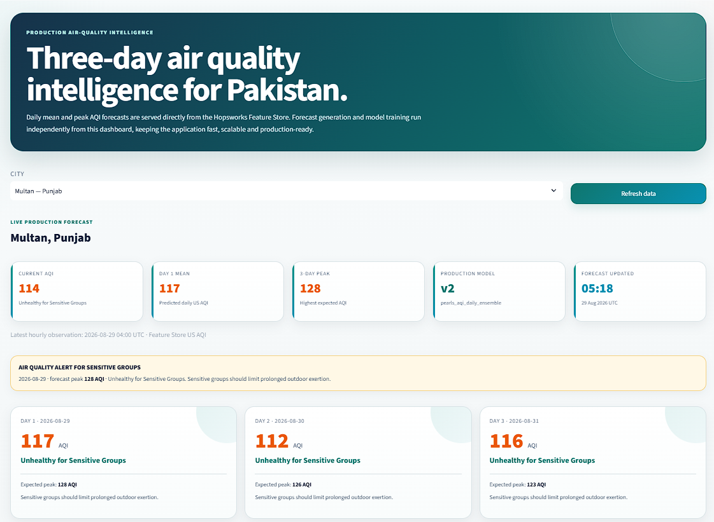

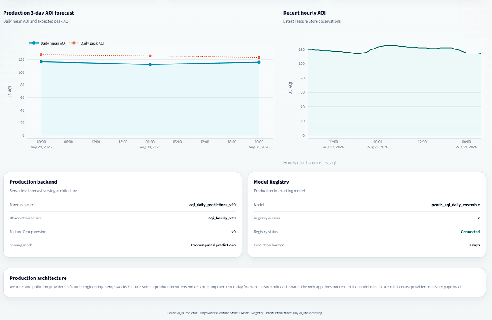

---

# 25. Production Dashboard Example

The captured Multan dashboard evidence shows:

- Current AQI: **114**
- Day-1 mean: **117**
- 3-day peak: **128**
- Model Registry version: **v2**
- Forecast status: **Unhealthy for Sensitive Groups**

The three displayed daily means were:

- Day 1: **117 AQI**
- Day 2: **112 AQI**
- Day 3: **116 AQI**

This screenshot is serving evidence, not a fixed benchmark. Values update as scheduled production predictions change.

---

# 26. Cloud Deployment

The dashboard is deployed using Streamlit Community Cloud.

Cloud serving uses:

```text
Streamlit Cloud
       |
       v
Hopsworks API authentication
       |
       +--> aqi_daily_predictions_v69
       |
       +--> aqi_hourly_v69
       |
       +--> Model Registry metadata
```

The production app uses precomputed Feature Store predictions instead of requiring a large ML runtime on the public web process.

This keeps the dashboard lightweight.

---

# 27. Security and Secret Management

Sensitive values are not committed to GitHub.

Local development uses:

```text
.env
```

Production deployment uses:

```text
Streamlit Secrets
```

Important values such as `HOPSWORKS_API_KEY` remain private.

The repository must never contain the real API key.

---

# 28. Requirement-Specific Web-App Design Note

The original brief describes an app that loads the model and features and computes predictions.

The implemented production architecture improves this by moving expensive prediction computation into the scheduled pipeline:

```text
Feature Store + Model Registry
          |
          v
Scheduled Production Forecast
          |
          v
Prediction Feature Group
          |
          v
Streamlit Dashboard
```

The dashboard still loads live production data from the Feature Store and accesses Model Registry metadata, but the forecast calculation itself is decoupled from page requests.

This is more scalable than recomputing the same three-day prediction for every dashboard visitor.

---

# 29. Known Limitations

## 29.1 Uneven City History

Historical target coverage is not equally strong for every city.

Multan was a recurring example: its city-level R² remained weaker because its usable historical AQI history was less complete than that of better-performing cities.

This contributes to the lower macro-city R².

## 29.2 Longer-Horizon Forecasting

Day-3 predictions are harder than Day-1 predictions because uncertainty increases with forecast horizon.

## 29.3 External Provider Availability

The production pipeline depends partly on third-party provider availability. Transient API/network failures can occasionally cause an hourly run to fail.

## 29.4 Pressure-Anomaly Feature Warning

During explainability/inference preparation, Scikit-learn may warn that `future_pressure_anomaly` contains no observed values for a particular matrix and is skipped during median imputation.

This warning does not block production, but the feature should be removed or conditionally generated when it has no usable observations.

## 29.5 Feature View / Hopsworks Online Deployment

The project uses Feature Groups directly, so Hopsworks may show:

- 0 Feature Views
- 0 Model Deployments

These values reflect architectural choices, not missing Feature Store or Model Registry functionality.

---

# 30. Future Improvements

The highest-value improvements are:

1. **Increase Multan historical AQI coverage** to improve city-specific and macro-city R².
2. Add automatic provider retries with exponential backoff.
3. Improve transient-failure logging and alerting.
4. Remove or conditionally generate all-missing features such as `future_pressure_anomaly`.
5. Experiment with sequence models such as LSTM and GRU.
6. Test temporal transformers.
7. Add probabilistic prediction intervals and calibration analysis.
8. Add drift monitoring.
9. Add automatic production performance monitoring as labels arrive.
10. Explore satellite aerosol / AOD data.
11. Add traffic and industrial-emission signals.
12. Add additional independent air-quality providers.
13. Add notification channels for hazardous forecasts.
14. Optionally introduce Hopsworks Feature Views for richer automatic lineage.
15. Add city-specific models when sufficient data becomes available.

---

# 31. Key Results Summary

| Area | Result |
|---|---|
| Historical hourly EDA rows | 175,200 |
| Daily EDA observations | 7,310 |
| Cities in EDA | 10 |
| Overall mean AQI | 119.81 |
| AQI ≥151 city-days | 23.56% |
| Strongest EDA positive correlation | PM2.5 ≈ 0.770 |
| Strongest EDA negative correlation | Wind speed ≈ -0.267 |
| Production pooled R² | **0.7473** |
| Production RMSE | **17.3178** |
| Production MAE | **12.2618** |
| Production bias | **-0.0245** |
| Day-3 R² | **0.6311** |
| Day-3 RMSE | **20.9695** |
| Macro-city R² | **0.4767** |
| Deep MLP R² | 0.5434 |
| Persistence R² | 0.6216 |
| Feature Groups | 4 |
| Feature Group version | 9 |
| Hopsworks production model version | 2 |
| Hourly cadence | minute 17 every hour |
| Daily training cadence | 03:25 UTC |
| Dashboard | Deployed on Streamlit Community Cloud |

---

# 32. Evidence Index

## 32.1 Production Dashboard

```text
reports/final/evidence/01_streamlit_dashboard_top.png
reports/final/evidence/02_streamlit_dashboard_bottom.png
```

## 32.2 Hopsworks Feature Store

```text
reports/final/evidence/03_hopsworks_feature_groups_v9.png
reports/final/evidence/04_hopsworks_predictions_feature_group_schema.png
```

## 32.3 Model Registry

```text
reports/final/evidence/05_hopsworks_model_registry_v2_metrics.png
reports/final/evidence/06_hopsworks_model_registry_v2_details.png
```

## 32.4 Hourly Automation

```text
reports/final/evidence/07_hopsworks_hourly_schedule.png
reports/final/evidence/08_hopsworks_hourly_successful_executions.png
reports/final/evidence/09_hopsworks_hourly_job_configuration.png
```

## 32.5 Daily Training Automation

```text
reports/final/evidence/10_hopsworks_daily_training_schedule.png
reports/final/evidence/11_hopsworks_daily_training_successful_execution.png
reports/final/evidence/12_hopsworks_daily_training_job_configuration.png
```

## 32.6 EDA

```text
reports/eda/01_city_mean_aqi.png
reports/eda/02_monthly_aqi_trend.png
reports/eda/03_seasonal_aqi.png
reports/eda/04_aqi_distribution.png
reports/eda/05_aqi_change_rate.png
reports/eda/06_missingness_top20.png
reports/eda/07_correlation_heatmap.png
reports/eda/08_aqi_vs_temperature.png
reports/eda/09_aqi_vs_humidity.png
reports/eda/10_aqi_vs_wind_speed.png
reports/eda/11_aqi_vs_pm25.png
```

## 32.7 Explainability

```text
reports/explainability/shap_day1_importance.png
reports/explainability/shap_day3_importance.png
reports/explainability/shap_day1_importance.csv
reports/explainability/shap_day3_importance.csv
reports/explainability/shap_report.json
reports/explainability/SHAP_SUMMARY.md
```

## 32.8 Deep Learning

```text
reports/deep_learning/01_training_history.png
reports/deep_learning/02_actual_vs_predicted.png
reports/deep_learning/deep_model_comparison.csv
reports/deep_learning/deep_learning_metrics.json
reports/deep_learning/test_predictions.csv
```

---

# 33. Final Submission Checklist

The project brief's four final deliverables are all represented in the repository:

### 1. End-to-End AQI Prediction System

Completed.

```text
External data
→ feature engineering
→ Feature Store
→ model
→ Model Registry
→ scheduled forecasts
→ prediction Feature Group
→ dashboard
```

### 2. Scalable Automated Pipeline

Completed.

- Hourly production pipeline
- Daily training pipeline
- Hopsworks managed execution
- Automatic Feature Store materialization
- Champion/challenger model workflow

### 3. Interactive Real-Time + Forecast Dashboard

Completed and deployed.

The dashboard displays:

- Latest/current AQI
- Three-day forecasts
- Peak forecasts
- AQI categories
- Health alerts
- Historical recent-hour chart
- Production model and backend status

### 4. Detailed Final Report

Completed in this document.

---

# 34. Conclusion

Pearls AQI Predictor demonstrates a complete AQI forecasting system rather than an isolated machine-learning notebook.

The project successfully integrates external data, historical backfill, feature engineering, a managed Feature Store, multiple machine-learning approaches, chronological evaluation, deep-learning experimentation, SHAP explainability, Model Registry versioning, automated hourly forecasting, automated daily retraining, hazardous-AQI warnings, and a deployed cloud dashboard.

The final production ensemble achieved:

- **R² = 0.7473**
- **RMSE = 17.3178**
- **MAE = 12.2618**
- **Bias = -0.0245**

The project also exposed an important real-world modelling lesson: aggregate performance can hide unequal city-level data quality. Multan repeatedly produced weaker city-level R² because of its more limited usable historical AQI target record, which helped pull the macro-city R² down to **0.4767**. This limitation is documented rather than hidden and provides a clear direction for future improvement: collect and maintain more reliable historical city-specific data.

The PyTorch experiment further demonstrated that complexity alone is not a reason to promote a model. The deep MLP underperformed the persistence baseline and production ensemble, so the stronger classical ensemble remained the production champion.

Overall, the final implementation satisfies the requested project lifecycle from raw data to a scalable, automated, explainable, interactive three-day AQI prediction service.

---

# 35. Repository and Live Application

**GitHub repository**

https://github.com/Kashan1272/Aqi_prediction

**Live Streamlit application**

`REPLACE_WITH_YOUR_STREAMLIT_APP_URL`

Before final submission, replace the placeholder above with the deployed Streamlit Community Cloud URL.
